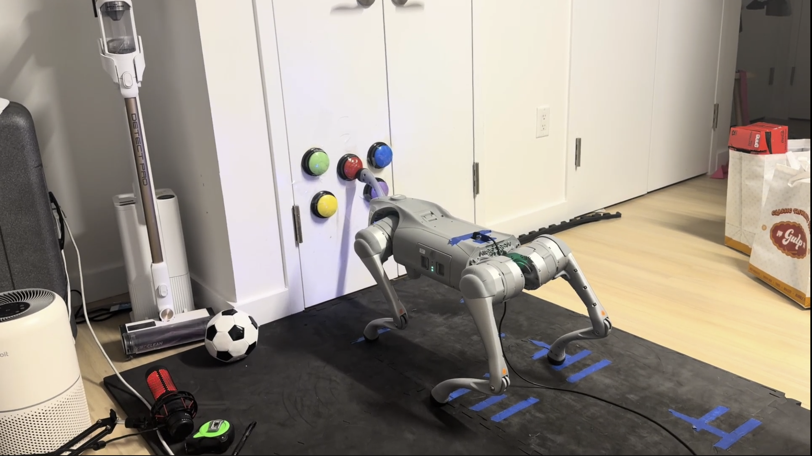

# Language-Conditioned Whole-Body Contact Manipulation for Quadruped Robots

A four-stage system that lets a Unitree Go2X press a spoken-or-typed-language-specified button on a wall using only its built-in monocular RGB camera — no depth sensor, no external motion capture.

<p align="center">
  
</p>

## Abstract

Quadrupedal manipulation typically relies on an attached arm or external depth sensing. We instead use the front-right leg as the contact effector and reach the button purely from the head camera's RGB feed. A four-stage pipeline parses a natural-language command into a structured task spec, grounds the target as a 3D point in the robot's base frame using a pretrained vision foundation stack, predicts an approach pose and FR-leg trajectory from a small MLP trained on hand-guided demonstrations, and refines all 12 joint targets during contact with a residual MLP running at 500 Hz. Across 10 real-robot trials per method, the pipeline lifts press success from **0/10** (open-loop heuristic) to **7/10** (full system), with no fine-tuning or simulation pretraining.

## Demo videos

Press rollouts, failure-mode gallery, and contact-time regrounding clips live in the `demo_videos/` folder of the project's [shared Google Drive](https://drive.google.com/drive/folders/13D-kQmxkGLzfAvpQ4tHyp4omylFbPO5e?usp=sharing).

## Key results

Real-robot evaluation, 10 trials per variant against the same button panel:

| Method | Standoff | Waypoints | Contact controller | Success |
|---|---|---|---|---|
| Heuristic baseline | hand-tuned | hardcoded | open-loop | **0 / 10** |
| Stage C only | learned | learned | open-loop + 2-shot regrounding | **4 / 10** |
| Full pipeline | learned | learned | Stage D residual at 500 Hz + 5 Hz contact regrounding | **7 / 10** |

- **Stage D offline validation MSE:** 6.66 × 10⁻⁵ on held-out episodes from the same 35-demo dataset.
- Paper checkpoints live under `models/stage_c_v5/`, `models/stage_d_v5/` (single-step Stage D), and `models/stage_d_v6_chunked/` (chunked Stage D with temporal ensembling). Earlier training runs are preserved under `models/archive/`.

## System requirements

**Hardware**
- Unitree Go2X (the variant with the front head camera + built-in compute board).
- A workstation with an NVIDIA GPU. The paper used an RTX 5080 (16 GB).
- Wired Ethernet link to the robot (the SDK uses DDS over a /24 subnet).
- USB microphone if you want voice commands (not required; typed prompts work).

**Software**
- Ubuntu 22.04 or newer (tested on WSL2 as well).
- CUDA 12.8.
- Python 3.11.
- PyTorch 2.7 with CUDA 12.8 wheels.

## Installation

### 1. Clone and create the deployment env

```bash
git clone https://github.com/<your-org>/Language_Conditioned_UniGo2.git
cd Language_Conditioned_UniGo2

conda env create -f environment.yaml      # creates env_go2 (Python 3.11)
conda activate env_go2

# PyTorch must be installed first, against your CUDA toolkit:
pip install torch==2.7.0 torchvision==0.22.0 --index-url https://download.pytorch.org/whl/cu128

pip install -r requirements.txt
pip install -e .                          # installs the project as `language_conditioned_unigo2`
```

### 2. Source-only dependencies

The two vision modules and the Unitree SDK are not on PyPI:

```bash
# SAM2 (Stage B segmentation)
pip install git+https://github.com/facebookresearch/sam2.git

# Unitree Go2 Python SDK (DDS / Sport Mode / video client)
pip install git+https://github.com/unitreerobotics/unitree_sdk2_python.git
```

GroundingDINO and Depth Anything V2 checkpoints are pulled from Hugging Face the first time `src.perception.grounding` is imported.

### 3. API key for Stage A

```bash
export OPENAI_API_KEY="sk-..."
```

The intent parser (`src/language/intent_parser.py`) calls `gpt-4` via the OpenAI Python SDK with deterministic temperature.

### 4. Pretrained weights and demonstration dataset

The 35-episode demonstration dataset and the three checkpoints used in the paper are released on Google Drive:

➡️ **[Language_Conditioned_UniGo2 — datasets, weights, demo videos](https://drive.google.com/drive/folders/13D-kQmxkGLzfAvpQ4tHyp4omylFbPO5e?usp=sharing)**

The Drive folder is organised as:

```
Language_Conditioned_UniGo2_drive/
├── dataset/
│   └── stage_d_v3/                   # 35 hand-guided wholebody episodes (HDF5)
├── Model_weights/
│   ├── stage_c_v5.pt                 # Stage C dual-head MLP (paper checkpoint)
│   ├── stage_d_v5.pt                 # Stage D single-step residual (paper checkpoint)
│   └── stage_d_v6_chunked.pt         # Stage D chunked residual (paper checkpoint)
└── demo_videos/
```

After downloading, lay the files out under the repo as follows — note that **the runtime code expects the filename `stage_c.pt` / `stage_d.pt` inside each model directory**, so rename on save:

```bash
# Demonstration dataset (only needed to retrain)
mkdir -p data/real
mv stage_d_v3 data/real/stage_d_v3

# Model checkpoints (needed for deployment / offline eval)
mkdir -p models/stage_c_v5 models/stage_d_v5 models/stage_d_v6_chunked
mv stage_c_v5.pt         models/stage_c_v5/stage_c.pt
mv stage_d_v5.pt         models/stage_d_v5/stage_d.pt
mv stage_d_v6_chunked.pt models/stage_d_v6_chunked/stage_d.pt
```

The `models/<name>/` directories already contain the matching `config.json`, `training_log.json`, and `eval.json` for each checkpoint — those are tracked in the repo so you can inspect training hyperparameters and offline metrics without downloading the weights.

### 5. Bring up the robot link

Every fresh session, the wired interface to the robot has to be configured. A helper is provided:

```bash
# Edit IFACE inside the script if your NIC is not enx98fc84e68f1a:
IFACE=enxXXXX ./scripts/setup_robot_connection.sh
```

The script assigns `192.168.123.99/24` to the chosen interface, pings the robot at `192.168.123.161`, and falls back to an nmap subnet scan if the ping fails.

## Quick start — run one press trial end-to-end

With the robot powered on, in Sport Mode, and the link up:

```bash
conda activate env_go2

# Full pipeline, paper configuration (Stage A -> B -> C -> D + contact regrounding).
# All paper-config flags (gravity FF on, compliance off, residual scale 0.5,
# Stage D on CPU) are already defaults in run_methods.py — just pick a variant
# and a mic index:
python scripts/run_methods.py \
    --variant core_method \
    --prompt "press the red button" \
    --mic-index 11
```

This runs the single-step Stage D model (`models/stage_d_v5/stage_d.pt`). To use the chunked Stage D model with temporal ensembling instead, add `--use-chunked --chunked-checkpoint models/stage_d_v6_chunked/stage_d.pt`.

Common opt-outs (each undoes one paper-config default):

```bash
--no-gravity-ff           # disable dynamic gravity-comp feedforward
--compliance              # re-enable soft FR + soft support gains during contact
--residual-scale 1.0      # apply Stage D residual at full magnitude
--stage-d-device cuda     # keep Stage D inference on the GPU
```

This runs **one trial** — Stage A parses the prompt, Stage B grounds the target, Stage C produces a standoff pose and FR waypoints, the robot walks to the standoff, then the contact phase runs Stage D residual control at 500 Hz with the GroundingThread regrounding at 5 Hz. A CSV row goes to `data/eval/` and the audio capture to `data/eval/audio/`.

The other two variants from the paper:

```bash
# Heuristic baseline (0/10)
python scripts/run_methods.py --variant baseline_1 --prompt "press the red button" ...

# Stage C only, no Stage D residual (4/10)
python scripts/run_methods.py --variant baseline_2 --prompt "press the red button" ...
```

Run `python scripts/run_methods.py --help` for the full flag set (gravity feedforward, residual scaling, contact regrounding toggle, etc.).

### Training (optional — checkpoints are released, see step 4)

The demonstration dataset on the Drive lives under a folder called `stage_d_v3/` even though it corresponds to the v4 collection round — the training scripts hard-coded the v3 path early on, and the name stuck. Drop it at `data/real/stage_d_v3/` and the commands below will find it:

```bash
# Stage C (5 -> {3, 9} dual-head MLP)
python scripts/train_stage_c.py --data-dirs data/real/stage_d_v3 --out-dir models/stage_c_v5

# Stage D, single-step (33 -> 12 residual)
python scripts/train_stage_d.py --data-dirs data/real/stage_d_v3 --out-dir models/stage_d_v5

# Stage D, chunked variant (predicts K=25 future steps per call, temporally ensembled at deploy)
python scripts/train_stage_d.py --data-dirs data/real/stage_d_v3 --out-dir models/stage_d_v6_chunked --chunk-size 25

# Offline evaluation
python scripts/eval_stage_c.py        --checkpoint-dir models/stage_c_v5
python scripts/eval_stage_d.py        --checkpoint-dir models/stage_d_v5
python scripts/eval_stage_d_chunked.py --checkpoint-dir models/stage_d_v6_chunked
```

## Repository structure

```
.
├── configs/
│   └── default.yaml                  # Stage A LLM prompt + decoding settings
├── data/                             # real episodes, eval CSVs, calibration (gitignored)
├── figures/                          # paper images + figure-generation scripts
├── models/
│   ├── stage_c_v5/                   # Stage C standoff+waypoint heads (paper)
│   ├── stage_d_v5/                   # Stage D single-step residual (paper)
│   ├── stage_d_v6_chunked/           # Stage D chunked residual (paper)
│   └── archive/                      # earlier training runs (intermediate experiments)
├── scripts/
│   ├── run_methods.py                # main deployment entry point (one trial / call)
│   ├── train_stage_c.py              # train standoff + waypoint MLPs
│   ├── train_stage_d.py              # train the 33->12 residual policy
│   ├── eval_stage_c.py               # offline evaluation, writes eval.json
│   ├── eval_stage_d.py               # offline evaluation, single-step model
│   ├── eval_stage_d_chunked.py       # offline evaluation, chunked model
│   ├── collect_guided.py             # Stage D v2 kinesthetic demonstration capture
│   ├── collect_wholebody.py          # Stage D v3 whole-body demonstration capture
│   ├── collect_stage_d.py            # Jacobian-PID expert demonstration capture
│   ├── calibrate_wall_standoff.py    # session-start standoff calibration
│   ├── setup_robot_connection.sh     # bring up wired link to the Go2
│   └── ...                           # validators, smoke tests, recompute_failure_modes
└── src/
    ├── data/                         # dataset, recorder, audio detector, grounding thread
    ├── language/                     # Stage A: GPT-4 intent parser
    ├── perception/                   # Stage B: GroundingDINO + SAM2 + Depth Anything V2
    ├── models/                       # Stage C and Stage D nn.Module definitions
    ├── planner/                      # heuristic contact controllers (base + corrective + guided + wholebody)
    ├── policy/                       # runtime inference wrappers for the trained models
    └── robot/                        # Unitree Go2 SDK interface
```

## Citation

If you build on this work, please cite the preprint:

```bibtex
@misc{gong2026language,
  title  = {Language-Conditioned Whole-Body Contact Manipulation for Quadruped Robots},
  author = {Gong, Hongkun and Bian, Hanzhi},
  year   = {2026},
  note   = {Preprint},
}
```

## Acknowledgments

This work builds on open-source releases of [GroundingDINO](https://github.com/IDEA-Research/GroundingDINO), [SAM2](https://github.com/facebookresearch/sam2), [Depth Anything V2](https://github.com/DepthAnything/Depth-Anything-V2), and the [Unitree Go2 Python SDK](https://github.com/unitreerobotics/unitree_sdk2_python). We thank the lab members and course staff who helped collect demonstrations and stage real-robot trials.

## License

This project is released under the MIT License — see [LICENSE](LICENSE).
